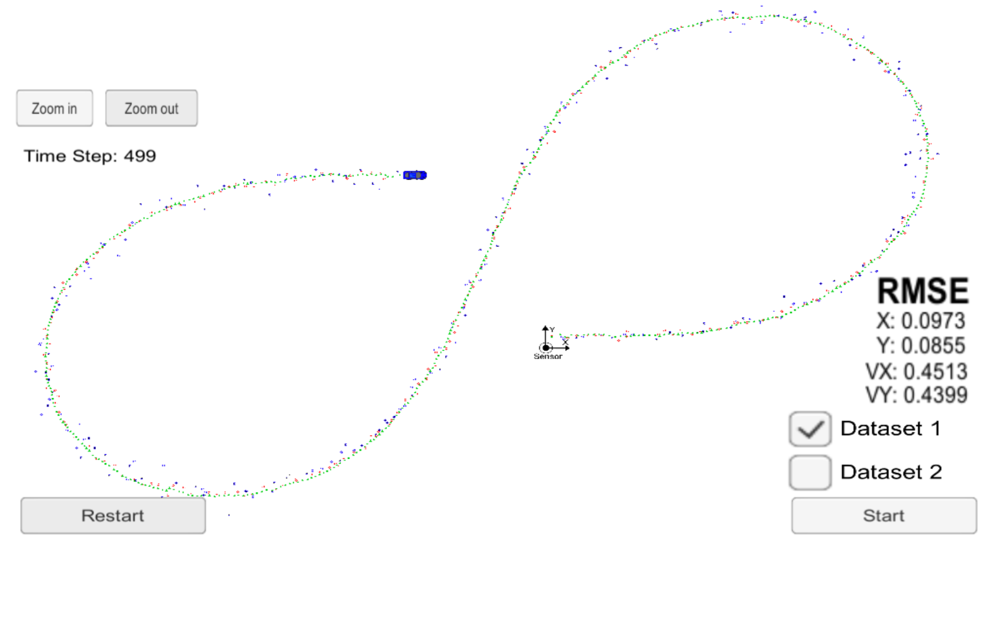
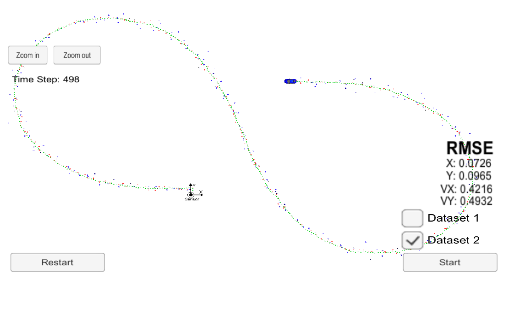

# Extended Kalman Filter Project

Self-Driving Car Engineer Nanodegree Program

This project implements kalman filter to estimate the state of a moving object of interest with noisy lidar and radar measurements. 

### Concept & Approach

1. Initialize with the very first measurement.
2. On every incoming measurement from LIDAR/RADAR sensor, update prediction matrices and new system state.
    * LIDAR Update: apply basic kalman filter 
    * RADAR Update: calculate Jacobian matrix before update to linearize input data
3. Compute RMSE, repeat Step 1 with the new error values.

### Implementation

1. Updated `install-mac.sh` to use the correct `openssl` path
2. Implemented Kalman filter in the class `KalmanFilter`, in the file `kalman_filter.cpp`
3. Updated `FusionEKF.cpp` file to implement prediction & update steps using the functions from `KalmanFilter`.
4. Implemented functions for RMSE & Jacobian calculations in `tools.cpp`.

### Results & Discussion

* The above diagrams show the results when executing the program against the simulator for two different datasets.
* The program has to be restarted when switching between the datasets. _(Scope for improvement)_

### Environment Setup

Install uWebSocketIO for the respective Operating System by following the documentation [here](https://classroom.udacity.com/nanodegrees/nd013/parts/40f38239-66b6-46ec-ae68-03afd8a601c8/modules/0949fca6-b379-42af-a919-ee50aa304e6a/lessons/f758c44c-5e40-4e01-93b5-1a82aa4e044f/concepts/23d376c7-0195-4276-bdf0-e02f1f3c665d)

### Build and Run 

1. Clone this repo.
2. Make a build directory: `mkdir build && cd build`
3. Compile: `cmake .. && make` 
   * On windows, you may need to run: `cmake .. -G "Unix Makefiles" && make`
4. Run it: `./ExtendedKF `
